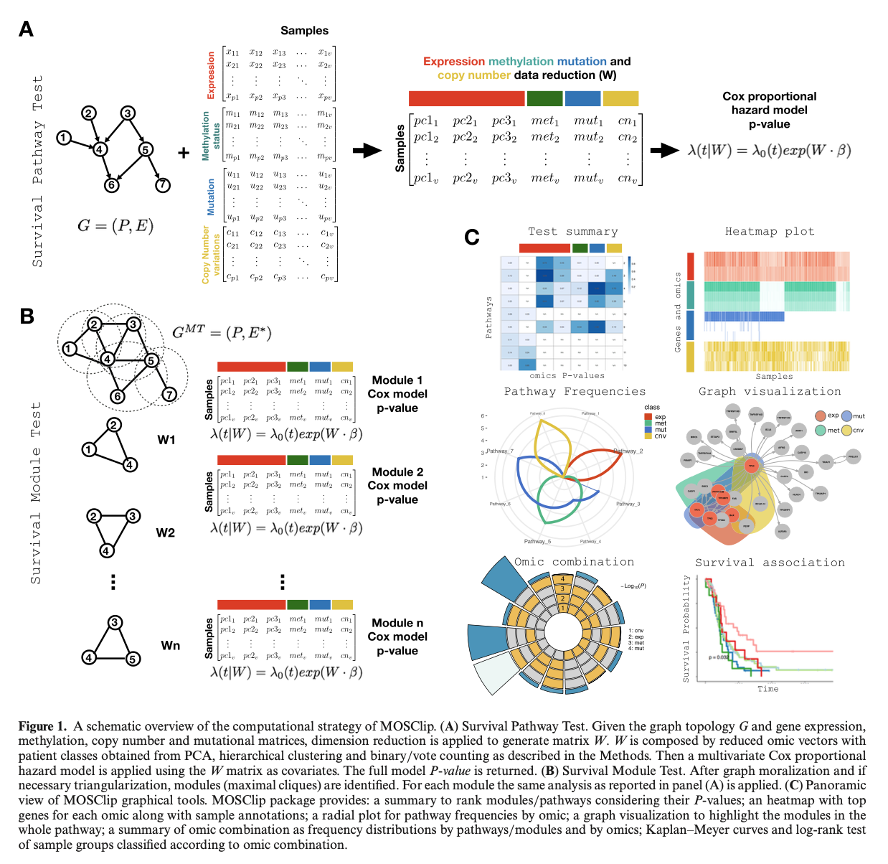

MOSClip
================

## Multi-Omics Survival Clip

`MOSClip` is a topological pathway analysis tool to test survival
association of pathways in a multi-omic framework.

## Description

`MOSClip` R package implements a statistical approach able to integrate
multi-omic data and look for survival associated gene modules. It
integrates multiple omics - trascriptomics, methylomics, genomic
mutations, and genomic copy number variations - using various data
dimensionality reduction strategies and multivariate models. Exploiting
graph theory, pathways can be decomposed into their connected
components, that we call modules. The analysis can then be performed at
the level of entire pathways or pathway modules. `MOSClip` pathway
analysis serves two primary purposes: testing the survival association
of pathways or modules using the Cox proportional hazard model, and
conducting a two-class analysis with a generalized linear model.
Additionally, the package offers valuable graphical tools to visualize
and interpret the results.

<p align="center">
  
</p>

## Installation

You can install `MOSClip` directly from GitHub writing the following
commands in your R console.

``` r
# Install devtools if not already installed
if (!requireNamespace("devtools", quietly = TRUE)) {
  install.packages("devtools")
}

# Install the package from GitHub
devtools::install_github("CaluraLab/MOSClip")
```
